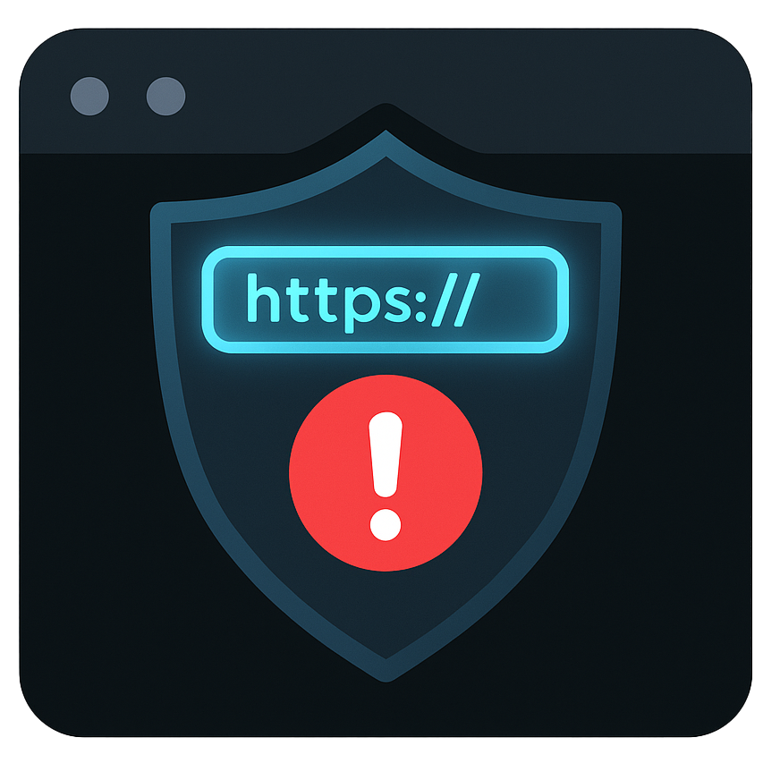
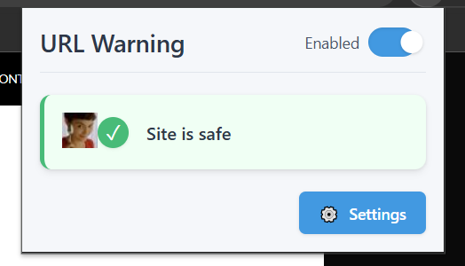
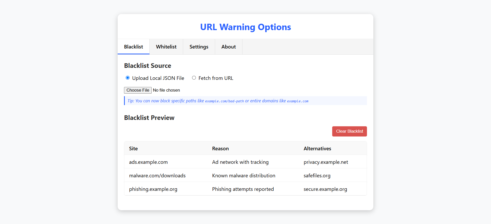
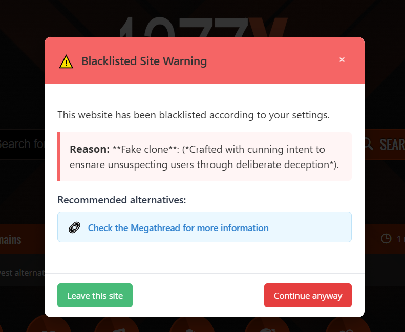
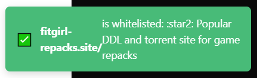

# URL Warning Chrome Extension

A powerful Chrome extension designed to protect users from potentially harmful websites by using customizable blacklists and whitelists.

## 🛡️ Features

### Core Protection
- **Real-time Website Scanning**: Instantly checks websites against your custom blacklist and whitelist
- **Path-based URL Matching** (NEW!): Target specific paths within domains (e.g., block `example.com/malware` but allow `example.com/safe`)
- **Auto-refreshing Lists**: Keep your protection up-to-date with scheduled refreshes
- **Smart Notification System**: Get informed about blocked sites and protection status

### Advanced Customization
- **Custom Blacklist & Whitelist Management**: 
  - Import from local JSON files
  - Fetch from remote URLs
  - Clear lists with a single click
- **Multiple Data Sources**:
  - Built-in default lists from [nerd.bh/apis/warnme/](https://nerd.bh/apis/warnme/)
  - Support for custom remote endpoints
  - Local file imports

### Online Search & API Access
- **Live Website Database**: Access the constantly updated online database of harmful websites
- **Public API**: Query the [nerd.bh/apis/warnme/](https://nerd.bh/apis/warnme/) API for real-time URL checks
- **Community-contributed Data**: Benefit from community-reported harmful websites
- **API Integration Options**: Use the same API for your own applications

### User Experience
- **Tab-based Settings Interface**: Easily navigate between Blacklist, Whitelist, Settings, and About
- **Sleek Notification Toasts**: Non-intrusive alerts with auto-dismissal
- **Mobile-friendly Design**: Responsive layout works on all devices
- **Terminal-styled About Page**: Unique developer information with animations

## 📸 Screenshots

| Main Popup | Options Page | Blacklisted Site Warning | Safe Site Notification |
|------------|--------------|---------------------------|------------------------|
|  |  |  |  |

## 🚀 Installation

### From Chrome Web Store
1. Visit [URL Warning on Chrome Web Store](#) *(Coming Soon)*
2. Click "Add to Chrome"
3. Confirm the installation

### Manual Installation
1. Download or clone this repository
2. Open Chrome and navigate to `chrome://extensions/`
3. Enable "Developer Mode" (toggle in the top-right corner)
4. Click "Load Unpacked" and select the downloaded folder
5. The extension is now installed and active

## 🔧 Usage

### Basic Usage
- The extension icon will change color based on the current site's status:
  - 🟢 Green: Safe site
  - 🔴 Red: Blacklisted site
  - 🔵 Blue: Whitelisted site
  - ⚪ Gray: Default/Not checked

- Click the extension icon to see site status and available actions

### Customizing Protection

#### Managing Blacklist
1. Open extension options by right-clicking the icon and selecting "Options"
2. Go to the "Blacklist" tab
3. Choose your blacklist source:
   - Upload a local JSON file
   - Fetch from a remote URL
   - Use the built-in default list
4. Clear the entire blacklist with the "Clear Blacklist" button when needed

#### Managing Whitelist
1. Navigate to the "Whitelist" tab
2. Add trusted sites that should bypass the protection
3. Import/export whitelist data as needed
4. Clear the entire whitelist with the "Clear Whitelist" button when needed

#### Advanced URL Patterns
- Block specific paths: `example.com/malware`
- Block subdomains: `ads.example.com`
- Block specific sections: `forum.example.com/spam`
- Block with wildcards: `*.example.com`

## ⚙️ Configuration Options

- **Auto-refresh Lists**: Choose refresh frequency (hourly, daily, weekly)
- **Notifications**: Toggle popup notifications and toast alerts
- **Refresh on Block**: Automatically refresh lists when a blocked site is encountered
- **Reset to Default**: Reset all settings to default values

## 🧪 Technical Details

- Built with vanilla JavaScript, HTML, and CSS
- Uses Chrome extension APIs for storage, notifications, and tab management
- Stores data in Chrome's local storage for fast access
- Fetches updated blacklist/whitelist data from remote endpoints
- Implements advanced URL pattern matching for precise control

## 📝 License

This project is licensed under the MIT License - see the [LICENSE](LICENSE) file for details.

## 👨‍💻 Author
- Portfolio: [nerd.bh](https://nerd.bh)
- GitHub: [imcr1](https://github.com/imcr1)

---

**Note to Contributors**: Please add screenshots to the `assets` folder before publishing. Required images include:
- `logo.png`: Extension logo (128x128px)
- `popup-preview.png`: Screenshot of the extension popup UI
- `options-preview.png`: Screenshot of the options page
- `warning-preview.png`: Screenshot of a blacklist warning notification
- `safe-preview.png`: Screenshot of safe site notification
